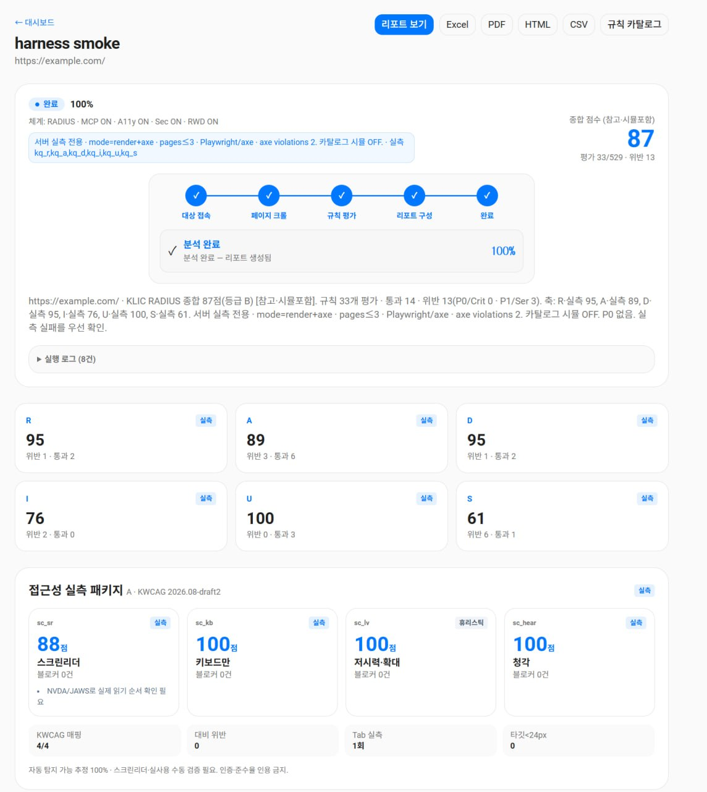
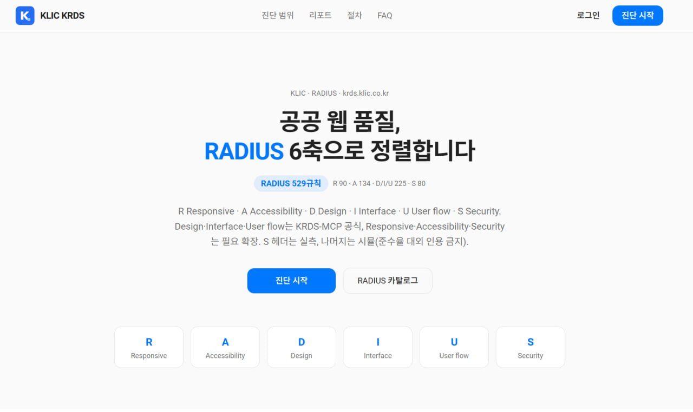
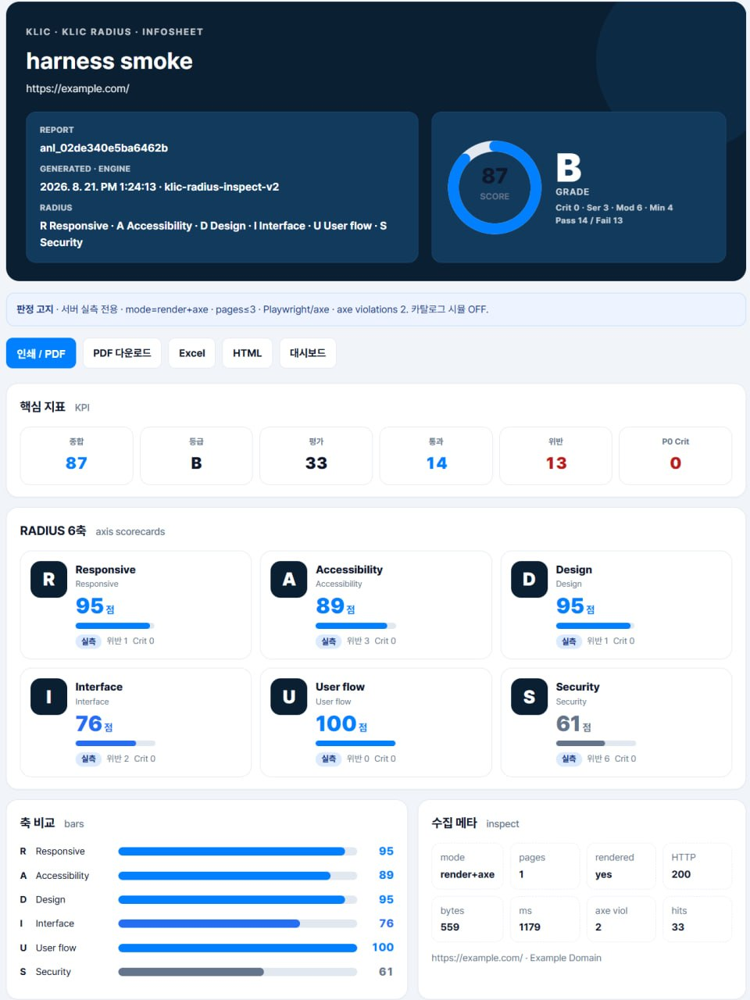

<div align="center">


# KLIC KRDS

### 공공·행정 웹 표준 진단 플랫폼

웹사이트의 **반응형(R) · 접근성(A) · 디자인(D) · 인터페이스(I) · 사용자흐름(U) · 보안(S)** 6개 축을 자동으로 검사하고, KRDS · KWCAG · 웹 보안 · 반응형 표준 기준으로 **529개 규칙**에 따라 진단 리포트를 생성합니다.

**한 번의 URL 입력으로 표준 적합성 진단 완료.**

</div>

---

## 📸 주요 화면

| 인트로 | 분석 | 리포트 |
|:---:|:---:|:---:|
|  |  |  |

---

## ✨ 주요 기능

| 축 | 영역 | 규칙 수 |
|:---:|---|---:|
| **R** | Responsive · 반응형 | 90 |
| **A** | Accessibility · 접근성 (KWCAG/axe 실측) | 134 |
| **D** | Design · 디자인 시스템 | 66 |
| **I** | Interface · 인터페이스/컴포넌트 | 138 |
| **U** | User flow · 사용자 흐름 | 21 |
| **S** | Security · 보안 (헤더/취약점) | 80 |
| | **합계** | **529** |

- **실측 엔진** — `klic-radius-inspect-v2` (Playwright + axe) 기반으로 렌더링 후 실제 검사
- **A11Y 실측** — WCAG 대비·키보드·리플로우·아웃라인 트리 실측 패키지
- **3-depth 크롤링** — 대상 사이트 3단계 하위 페이지까지 자동 탐색
- **실시간 이벤트** — 검사 진행 상황 SSE로 실시간 스트리밍
- **4종 리포트** — HTML · Excel · CSV · PDF
- **KRDS · KWCAG 정렬** — 공공 디자인 시스템 규칙 매핑

## 🚀 시작하기

### 로컬 실행

```bash
npm install
npm run dev
```

기본 접속: <http://localhost:3000>

> **데모 계정** — `demo@klic.local` / `demo1234`

### 프로덕션 빌드

```bash
npm run build
npm run start
```

## 🖥️ 대시보드

| | |
|---|---|
| **분석** | URL 입력 → 실측 검사 → 6축 점수 · 규칙별 통과/실패 · 증거 |
| **규칙 브라우저** | 529개 규칙 카탈로그 (축별 필터 · 심각도 · 검사 기준) |
| **리포트** | HTML/Excel/CSV/PDF 4종 내보내기 · 인쇄용 뷰 |
| **접근성 실측** | axe 위반 · 대비 비율 · 키보드 탐색 · 리플로우 |

## 🔧 개발 명령

| 명령 | 설명 |
|---|---|
| `npm run dev` | 개발 서버 |
| `npm run typecheck` | TypeScript 검사 |
| `npm run lint` | ESLint 검사 |
| `npm run build` | 프로덕션 빌드 |
| `npm run check` | lint + typecheck + build |
| `npm run rules:generate-kq` | 529개 규칙 카탈로그 재생성 |
| `npm run rules:validate-krds-mcp` | KRDS MCP 카탈로그 검증 |

### 검증 하네스

```bash
bash scripts/harness-krds.sh smoke    # 재기동 + 스모크 검증 (health/login/rules/inspect/report)
bash scripts/harness-krds.sh full     # 빌드 → 재기동 → 병렬 실사이트 탐색 → 4종 리포트 → 감사
KRDS_HARNESS_NOTIFY=1 bash scripts/harness-krds.sh   # 결과를 Telegram으로 알림
```

산출물: `.data/harness/<timestamp>/` — summary.json · report.html · xlsx · csv · pdf

## 🏗️ 기술 스택

- **Next.js 16** — App Router · React 19 · TypeScript strict
- **shadcn/ui** — Radix primitives + Tailwind CSS v4
- **Playwright + axe-core** — 실측 검사 엔진
- **SQLite** — 분석 기록 저장

## 📁 프로젝트 구조

```
src/
  app/                  # Next.js 라우트 (API / dashboard / login / rules)
  components/sites/krds/ # 대시보드·랜딩 컴포넌트
  lib/krds/             # 진단 엔진 코어
    inspect/            #   실측 검사 (a11y · crawl · probe · axe-bridge)
    export/             #   HTML · Excel · PDF 리포트 생성
    rules/              #   529개 규칙 카탈로그 + 데이터
    analyzer.ts         #   분석 파이프라인
    events.ts           #   SSE 실시간 이벤트
scripts/
  harness-krds.sh       # 검증 하네스
  harness-krds.py       #  하네스 v2 (full/smoke/build/report/audit)
  generate-kq-catalog.mjs # 규칙 카탈로그 생성
```

## 📜 라이선스

MIT
